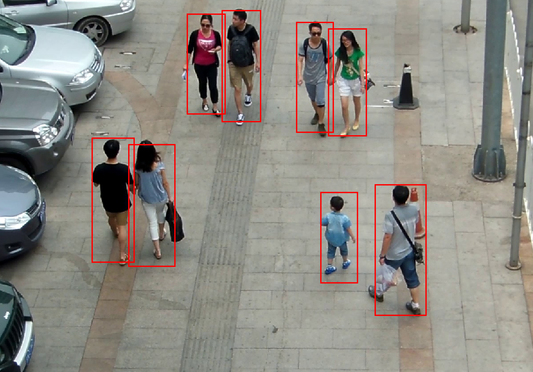

# person-detection-asl-0001

## Use case and High-level description

This is a person detector for the ASL Recognition scenario. It is based on ShuffleNetV2-like backbone that includes depth-wise convolutions to reduce the amount of computation for the 3x3 convolution block and FCOS  head.

## Example

## Specification

| Metric                          | Value                                     |
|---------------------------------|-------------------------------------------|
| Persons AP on MS-COCO\*         | 68.40%                                    |
| Minimal person height           | 100 pixel                                 |
| GFlops                          | 0.986                                     |
| MParams                         | 1.338                                     |
| Source framework                | PyTorch\*                                 |

Average Precision (AP) is defined as an area under the [precision/recall](https://en.wikipedia.org/wiki/Precision_and_recall) curve.

## Performance

## Inputs

Name: "input" , shape: [1x3x320x320] - An input image in the format [1xCxHxW], where:
 - C - number of channels
 - H - image height
 - W - image width

Expected color order is BGR.

## Outputs

The net outputs blob with shape: [N, 5], where N is the number of detected
bounding boxes. For each detection, the description has the format:
[`x_min`, `y_min`, `x_max`, `y_max`, `conf`]
 - (`x_min`, `y_min`) - coordinates of the top left bounding box corner
 - (`x_max`, `y_max`) - coordinates of the bottom right bounding box corner.
 - `conf` - confidence for the predicted class

## Legal Information
[\*] Other names and brands may be claimed as the property of others.
